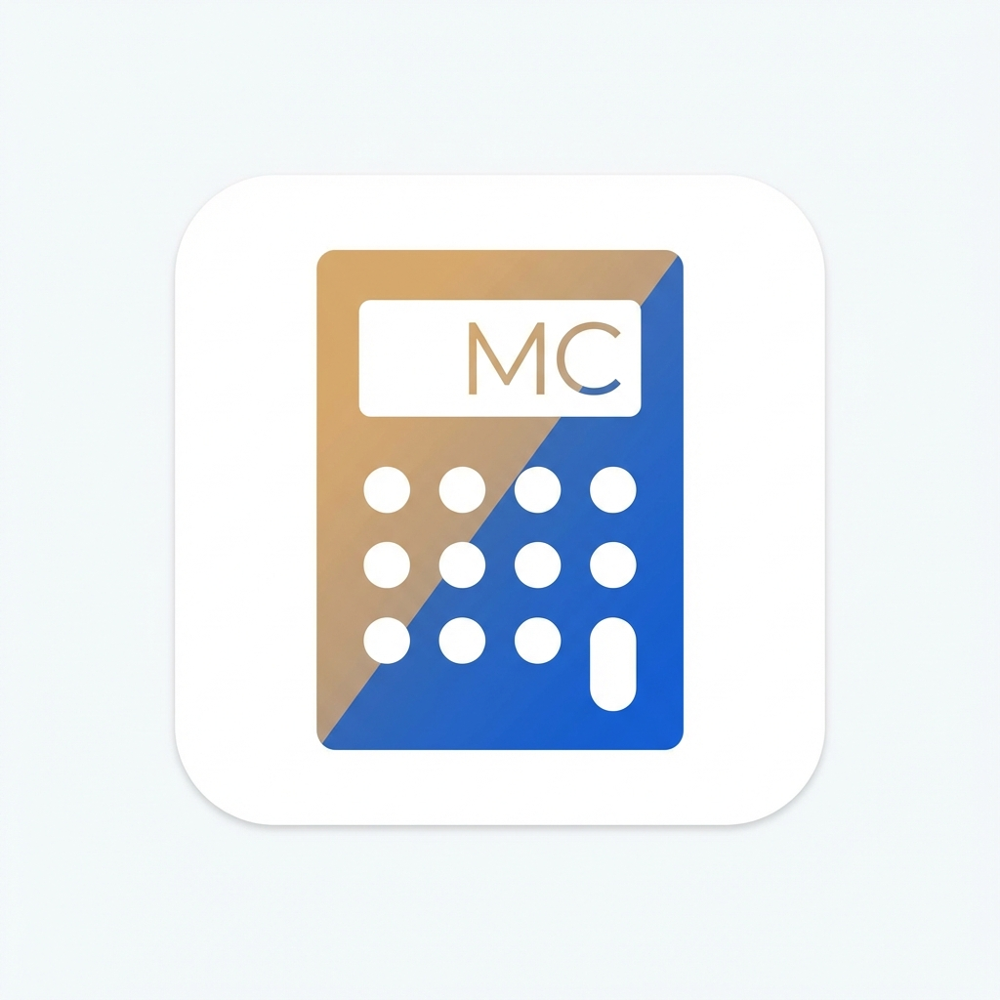

<p align="center">
  
</p>

<h1 align="center">Malta Calculator</h1>

<p align="center">
  <strong>The #1 financial calculation platform for Malta residents and businesses</strong>
</p>

<p align="center">
  <a href="https://maltacalculator.com">Website</a> &middot;
  <a href="https://twitter.com/maltacalculator">Twitter</a> &middot;
  <a href="https://maltacalculator.com/blog">Blog</a> &middot;
  <a href="https://maltacalculator.com/pricing">Pricing</a>
</p>

<p align="center">
  
  
  
  
  
  
</p>

---

## Overview

**Malta Calculator** is a comprehensive financial platform built for individuals and businesses in Malta. It provides **29+ free calculators**, a **B2B payroll/payslip system** with Stripe-powered subscriptions, and **40+ SEO-optimized blog articles** covering Malta's tax system, employment law, benefits, and financial planning.

### Key Highlights

- **29 Free Calculators** — Salary, tax, SSC, mortgage, pension, vehicle, benefits, and more
- **B2B Payroll System** — Generate professional payslips, manage employees, subscription-based (Free / Basic / Pro)
- **40+ Blog Articles** — In-depth guides on Malta's financial landscape, updated for 2024-2026
- **Multi-Year Tax Support** — Accurate tax brackets, SSC rates, and COLA for 2024, 2025, and 2026
- **Full SEO Stack** — Dynamic OG images, JSON-LD structured data, sitemap, hreflang alternates

---

## Table of Contents

- [Tech Stack](#tech-stack)
- [Calculators](#calculators)
- [B2B Payroll System](#b2b-payroll-system)
- [Blog & Content](#blog--content)
- [Project Structure](#project-structure)
- [Getting Started](#getting-started)
- [Environment Variables](#environment-variables)
- [Development](#development)
- [Malta Tax System Reference](#malta-tax-system-reference)
- [SEO & Metadata](#seo--metadata)
- [API Endpoints](#api-endpoints)
- [Architecture Decisions](#architecture-decisions)
- [Database Schema](#database-schema)
- [License](#license)

---

## Tech Stack

| Category      | Technology                                         |
| ------------- | -------------------------------------------------- |
| **Framework** | Next.js 16 (App Router, Static Generation)         |
| **Language**  | TypeScript 5 (strict mode)                         |
| **UI**        | React 18, Tailwind CSS 3, Radix UI                 |
| **Animation** | Framer Motion, GSAP                                |
| **Database**  | Supabase (PostgreSQL)                              |
| **Auth**      | Clerk                                              |
| **Payments**  | Stripe (Checkout, Webhooks, Customer Portal)       |
| **Forms**     | React Hook Form + Zod validation                   |
| **State**     | nuqs (type-safe URL search params)                 |
| **Charts**    | Tremor                                             |
| **Tables**    | TanStack React Table                               |
| **Storage**   | AWS S3 (company logos, uploads)                    |
| **Analytics** | Google Analytics, Vercel Analytics, Speed Insights |
| **Hosting**   | Vercel                                             |

---

## Calculators

29 free calculators organized by category:

### Tax & Salary

| Calculator            | Description                                           |
| --------------------- | ----------------------------------------------------- |
| **Salary Calculator** | Gross-to-net with tax brackets, SSC, COLA (2024-2026) |
| **Self-Employed Tax** | Income tax for self-employed individuals              |
| **Self-Employed SSC** | Social security contributions for self-employed       |
| **Expatriate Tax**    | Tax calculation for expats (HQP/OSHP schemes)         |
| **Rental Income Tax** | 15% flat rate rental income tax                       |
| **Bonus Tax**         | Tax on bonus and 13th month payments                  |

### Benefits & Allowances

| Calculator               | Description                                 |
| ------------------------ | ------------------------------------------- |
| **Children's Allowance** | Government children's allowance eligibility |
| **Childcare Benefit**    | Free childcare scheme calculator            |
| **In-Work Benefit**      | Government in-work benefit calculation      |
| **Maternity Leave**      | Maternity leave entitlement and pay         |
| **Sick Leave**           | Sick leave entitlement calculator           |

### Employment

| Calculator         | Description                                  |
| ------------------ | -------------------------------------------- |
| **Overtime**       | Overtime rates (1.5x, 2x) and pay            |
| **Vacation Leave** | Annual leave entitlement by years of service |
| **Notice Period**  | Legal notice period calculation              |
| **Part-Time**      | Part-time employment rights and pro-rata     |

### Financial & Property

| Calculator           | Description                                |
| -------------------- | ------------------------------------------ |
| **Mortgage**         | Monthly mortgage payments and amortization |
| **Personal Loan**    | Loan repayment calculator                  |
| **First-Time Buyer** | First-time property buyer scheme           |
| **Savings Interest** | Savings account interest calculator        |
| **Pension**          | Pension projection calculator              |
| **Retirement Age**   | Official retirement age calculator         |
| **Stamp Duty**       | Property stamp duty calculation            |

### Vehicle

| Calculator                         | Description                        |
| ---------------------------------- | ---------------------------------- |
| **Vehicle Registration Tax (VRT)** | New/used vehicle registration tax  |
| **Vehicle Registration Fee**       | Registration fee calculation       |
| **Road License**                   | Annual road license fees           |
| **Import Vehicle**                 | Vehicle import cost calculator     |
| **Driver's License**               | License application fee calculator |

### Immigration

| Calculator               | Description                     |
| ------------------------ | ------------------------------- |
| **Family Reunification** | Visa and permit cost calculator |

---

## B2B Payroll System

A subscription-based payroll management platform for Malta-based businesses:

### Features

- **Employee Management** — Add, edit, and manage employee records
- **Payslip Generation** — Professional PDF payslips with accurate Malta calculations
- **PIN Verification** — Secure employee access to their payslips
- **QR Codes** — Shareable payslip verification links
- **Company Dashboard** — Overview of payroll, employees, and usage
- **Team Management** — Multi-user access per company

### Subscription Plans

| Feature           |   Free    |   Basic   |    Pro    |
| ----------------- | :-------: | :-------: | :-------: |
| Salary Calculator | Unlimited | Unlimited | Unlimited |
| Employees         |     3     |    25     | Unlimited |
| Payslips/month    |     5     |    50     | Unlimited |
| PDF Export        |     -     |    Yes    |    Yes    |
| API Access        |     -     |     -     |    Yes    |
| Priority Support  |     -     |     -     |    Yes    |

### Payment Flow

1. User signs up via **Clerk** authentication
2. Company onboarding collects business details
3. Stripe Checkout for plan selection
4. Webhook updates subscription in Supabase
5. Customer Portal for billing management

---

## Blog & Content

40+ articles covering Malta's financial landscape, organized by topic:

- **Tax Guides** — Tax rates, refunds, self-employment, rental income, crypto taxation, double taxation treaties
- **Employment** — Minimum wage, overtime, 13th month salary, SSC explained, salary calculation
- **Benefits** — Children's allowance, maternity leave, vacation entitlement, COLA
- **Residency & Immigration** — Single permit, family reunification, work permits, social security numbers
- **Financial Products** — Mortgages (residents & expats), personal loans, first-time buyer scheme, savings, pensions
- **Vehicles** — VRT, road license, driver's license, vehicle import
- **Property** — Stamp duty, property transfer tax

Each article includes:

- SEO-optimized metadata with dynamic OG images
- JSON-LD structured data (Article, FAQ, Breadcrumb)
- Comment system with voting
- Related article recommendations

---

## Project Structure

```
src/
├── app/                          # Next.js App Router
│   ├── api/                     # API routes
│   │   ├── blog/comments/       # Blog comment & voting API
│   │   ├── calculator/share/    # Calculator sharing
│   │   ├── company/logo/        # S3 logo upload
│   │   ├── employee/            # Employee verification
│   │   ├── og/                  # Dynamic OG image generation
│   │   ├── payslip/generate/    # PDF payslip generation
│   │   ├── public/tax-rates/    # Public tax rates API
│   │   ├── salary/calculate/    # Salary calculation API
│   │   └── stripe/              # Checkout, webhooks, portal
│   ├── blog/                    # 40+ blog posts (static)
│   ├── calculators/             # 29 calculator pages
│   ├── dashboard/               # Company dashboard (auth)
│   ├── employees/               # Employee management
│   ├── onboarding/              # Company onboarding flow
│   ├── payslip/                 # Payslip CRUD & verification
│   ├── pricing/                 # Subscription pricing page
│   ├── salary/                  # Main salary calculator
│   ├── settings/                # Company settings
│   ├── sign-in/                 # Clerk sign-in
│   ├── sign-up/                 # Clerk sign-up
│   └── shared-metadata.ts       # SEO constants & helpers
├── components/
│   ├── ui/                      # Radix UI component library (26+)
│   ├── layout/                  # Navigation, header, footer
│   ├── marketing/               # Landing page components
│   ├── salary/                  # Salary calculator components
│   ├── blog/                    # Blog article components
│   ├── dashboard/               # Dashboard components
│   └── json-ld.tsx              # Structured data components
├── config/
│   └── malta-tax-config.ts      # Tax brackets, SSC rates, COLA
├── data/                        # Static data files
├── hooks/                       # Custom React hooks
├── lib/
│   ├── supabase/                # Supabase client (admin/client/server)
│   ├── stripe.ts                # Stripe initialization
│   ├── s3/                      # AWS S3 upload
│   └── utils.ts                 # General utilities
├── types/
│   └── database.ts              # Supabase type definitions
└── utils/
    └── salary-calculator.ts     # Core salary calculation engine
```

---

## Getting Started

### Prerequisites

- **Node.js** >= 18
- **npm** or **yarn**
- **Supabase** project (for database)
- **Clerk** account (for authentication)
- **Stripe** account (for payments, optional for dev)

### Installation

```bash
# Clone the repository
git clone https://github.com/atknatk/malta-calculator.git
cd malta-calculator

# Install dependencies
npm install

# Set up environment variables
cp .env.example .env.local
# Edit .env.local with your credentials

# Start development server
npm run dev
```

The app will be available at [http://localhost:3000](http://localhost:3000).

---

## Environment Variables

Create a `.env.local` file with the following variables:

```env
# Supabase
SUPABASE_URL=https://your-project.supabase.co
SUPABASE_ANON_KEY=your-anon-key
SUPABASE_SERVICE_ROLE_KEY=your-service-role-key

# Clerk Authentication
CLERK_SECRET_KEY=sk_test_...
NEXT_PUBLIC_CLERK_PUBLISHABLE_KEY=pk_test_...
NEXT_PUBLIC_CLERK_SIGN_IN_URL=/sign-in
NEXT_PUBLIC_CLERK_SIGN_UP_URL=/sign-up
NEXT_PUBLIC_CLERK_AFTER_SIGN_IN_URL=/dashboard
NEXT_PUBLIC_CLERK_AFTER_SIGN_UP_URL=/onboarding

# Stripe Payments
STRIPE_SECRET_KEY=sk_test_...
STRIPE_WEBHOOK_SECRET=whsec_...
STRIPE_BASIC_PRICE_ID=price_...
STRIPE_PRO_PRICE_ID=price_...

# AWS S3 (file uploads)
AWS_ACCESS_KEY_ID=your-access-key
AWS_SECRET_ACCESS_KEY=your-secret-key
AWS_REGION=eu-central-1
AWS_S3_BUCKET=your-bucket-name

# API Token
SALARY_API_TOKEN=your-api-token
NEXT_PUBLIC_SALARY_API_TOKEN=your-public-api-token

# Google Analytics (optional)
NEXT_PUBLIC_GA_ID=G-XXXXXXXXXX
```

---

## Development

### Commands

```bash
npm run dev       # Start development server (port 3000)
npm run build     # Production build with static generation
npm run start     # Start production server
npm run lint      # Run ESLint checks
```

### Key Development Patterns

**Static Pages** — All public pages use static generation:

```typescript
export const revalidate = false;
export const dynamic = "force-static";
```

**URL State Management** — Calculator state is synced to URL via `nuqs`:

```typescript
import { parseAsString, useQueryState } from "nuqs";
const [salary, setSalary] = useQueryState("salary", parseAsString);
```

**Conditional Styling** — Using the `cn()` utility:

```typescript
import { cn } from "@/lib/utils";
<div className={cn("base-class", condition && "conditional-class")} />
```

**Supabase Client**:

```typescript
// Client-side (browser)
import { createClient } from "@/lib/supabase/client";

// Server-side (API routes, server components)
import { createClient } from "@/lib/supabase/server";
```

---

## Malta Tax System Reference

The calculator engine supports the full Malta tax system for **2024, 2025, and 2026**:

### Tax Categories

| Category | Description                                  |
| -------- | -------------------------------------------- |
| Single   | Unmarried individuals                        |
| Married  | Married couples (0, 1, 2+ children variants) |
| Parent   | Single parents (0, 1, 2+ children variants)  |

### SSC (Social Security Contributions)

| Category | Type                | Weekly Cap (2026) |
| -------- | ------------------- | ----------------- |
| A        | Pensioners          | EUR 6.62          |
| B        | Part-time employees | EUR 22.94         |
| C        | Full-time employees | EUR 55.93         |
| D        | Self-employed       | EUR 55.93         |

### COLA (Cost of Living Adjustment) - 2026

| Quarter      | Amount     |
| ------------ | ---------- |
| Q1 (Jan-Mar) | EUR 121.16 |
| Q2 (Apr-Jun) | EUR 135.10 |
| Q3 (Jul-Sep) | EUR 121.16 |
| Q4 (Oct-Dec) | EUR 135.10 |

### Weekly SSC Cap

**EUR 559.31** (2026)

> Tax configuration is maintained in `src/config/malta-tax-config.ts` and validated against official Malta CFR and Social Security Department publications.

---

## SEO & Metadata

### Stack

- **Dynamic OG Images** — Generated via `/api/og` endpoint with custom designs
- **JSON-LD Structured Data** — Article, FAQ, Breadcrumb, Calculator, Organization, Website schemas
- **Sitemap** — Auto-generated at `/sitemap.xml`
- **Hreflang** — `en-MT` and `x-default` alternates for all pages
- **Twitter Cards** — Summary large image with `@maltacalculator` attribution

### Metadata Helpers

```typescript
import {
  generateBlogMetadata,
  generatePageMetadata,
  pageAlternates,
} from "@/app/shared-metadata";

// Blog post metadata
export const metadata = generateBlogMetadata({
  title: "Malta Tax Rates 2026 | Malta Calculator",
  description: "Complete guide to Malta tax rates...",
  slug: "malta-tax-rates-2026",
  keywords: ["malta tax rates", "2026"],
  datePublished: "2025-01-01",
});

// Generic page metadata
export const metadata = generatePageMetadata({
  title: "Mortgage Calculator",
  description: "Calculate your Malta mortgage...",
  path: "/calculators/mortgage",
});
```

---

## API Endpoints

### Public

| Endpoint                | Method | Description                        |
| ----------------------- | ------ | ---------------------------------- |
| `/api/public/tax-rates` | GET    | Current Malta tax rates data       |
| `/api/salary/calculate` | POST   | Salary calculation engine          |
| `/api/calculator/share` | POST   | Generate shareable calculator link |
| `/api/og`               | GET    | Dynamic OG image generation        |

### Blog

| Endpoint                  | Method   | Description              |
| ------------------------- | -------- | ------------------------ |
| `/api/blog/comments`      | GET/POST | Read/write blog comments |
| `/api/blog/comments/vote` | POST     | Vote on comments         |

### B2B (Authenticated)

| Endpoint                   | Method | Description               |
| -------------------------- | ------ | ------------------------- |
| `/api/payslip/generate`    | POST   | Generate PDF payslip      |
| `/api/employee/verify-pin` | POST   | Employee PIN verification |
| `/api/company/logo`        | POST   | Upload company logo to S3 |

### Stripe

| Endpoint               | Method | Description                  |
| ---------------------- | ------ | ---------------------------- |
| `/api/stripe/checkout` | POST   | Create checkout session      |
| `/api/stripe/webhook`  | POST   | Handle Stripe events         |
| `/api/stripe/portal`   | POST   | Customer billing portal link |

---

## Architecture Decisions

| Decision                  | Rationale                                                                |
| ------------------------- | ------------------------------------------------------------------------ |
| **Next.js App Router**    | Server components for SEO, static generation for calculator pages        |
| **Static Generation**     | All public pages are statically generated for maximum performance        |
| **nuqs for URL State**    | Calculator inputs persist in URL for shareability and bookmarking        |
| **Supabase**              | Managed PostgreSQL with real-time capabilities and built-in auth helpers |
| **Clerk**                 | Enterprise-grade auth with social logins, separate from database auth    |
| **Stripe Checkout**       | PCI-compliant payment flow without handling card data                    |
| **Radix UI**              | Accessible, unstyled primitives for consistent component behavior        |
| **Zod + React Hook Form** | Runtime validation that matches TypeScript types                         |
| **AWS S3**                | Scalable file storage for company logos and generated documents          |
| **Dynamic OG Images**     | Custom `/api/og` endpoint generates social preview images per page       |

---

## Database Schema

| Table         | Description                                              |
| ------------- | -------------------------------------------------------- |
| `companies`   | Company profiles, subscription plans, Clerk user mapping |
| `employees`   | Employee records with salary details (JSON)              |
| `payslips`    | Generated payslip documents                              |
| `daily_usage` | Rate limiting and usage tracking per company             |

---

## Contributing

1. Fork the repository
2. Create a feature branch (`git checkout -b feature/amazing-feature`)
3. Commit your changes (`git commit -m 'Add amazing feature'`)
4. Push to the branch (`git push origin feature/amazing-feature`)
5. Open a Pull Request

---

## License

This project is proprietary software. All rights reserved.

---

<p align="center">
  Built with care for the Malta community<br/>
  <a href="https://maltacalculator.com">maltacalculator.com</a>
</p>
